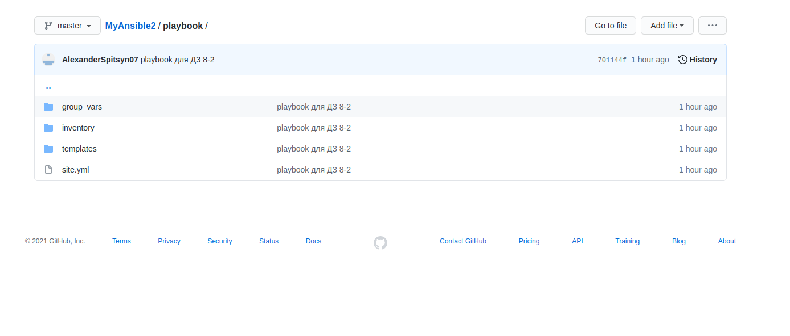
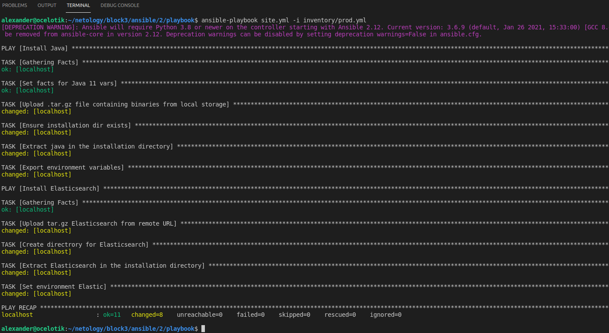
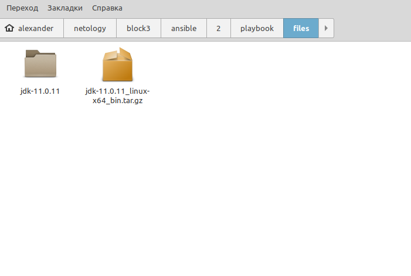
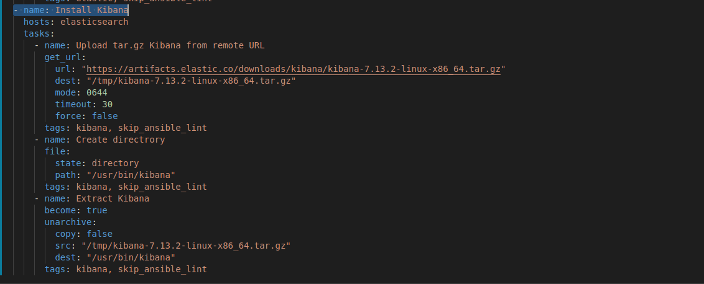
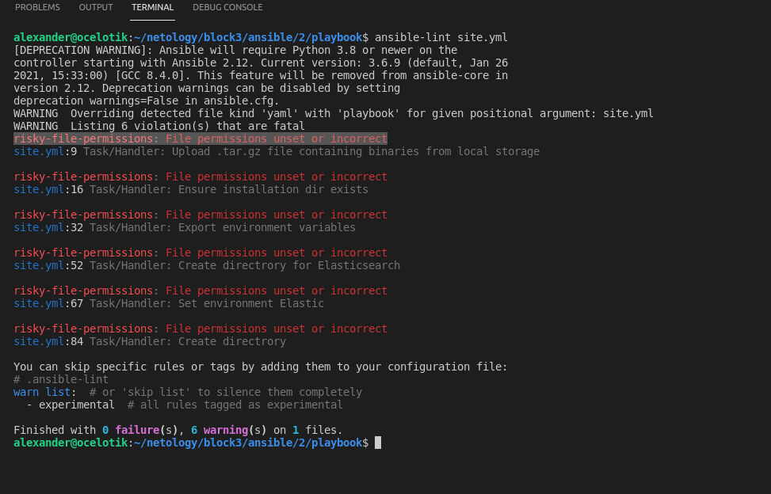
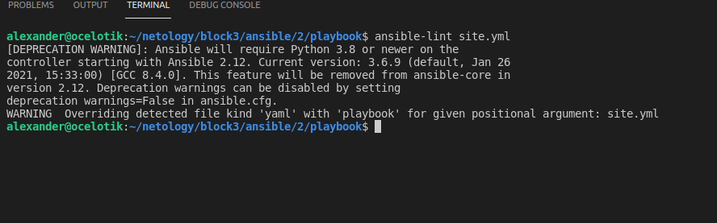
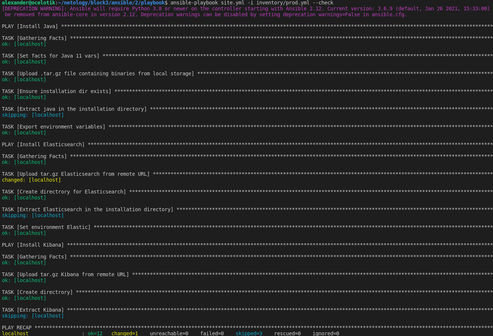
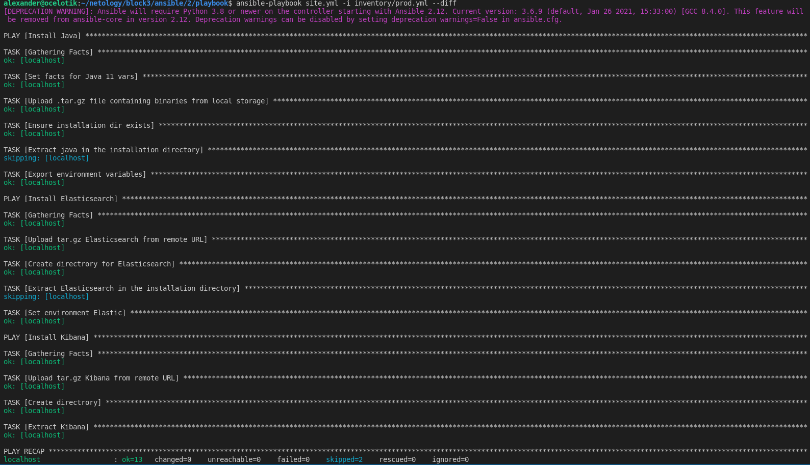
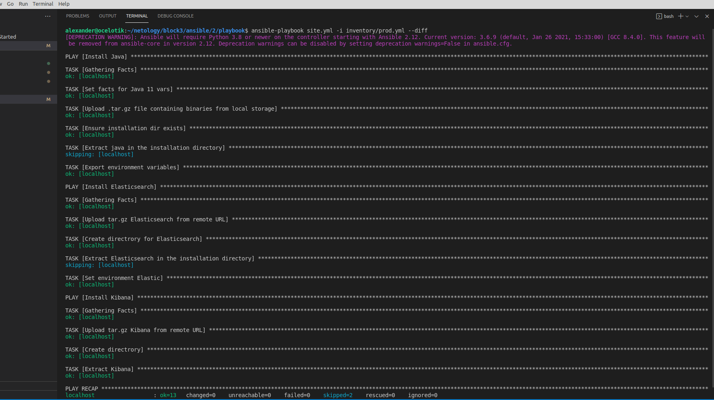

# Домашнее задание к занятию "08.02 Работа с Playbook"
## Подготовка к выполнению
1. Создайте свой собственный (или используйте старый) публичный репозиторий на github с произвольным именем.
2. Скачайте [playbook](./playbook/) из репозитория с домашним заданием и перенесите его в свой репозиторий.
3. Подготовьте хосты в соотвтествии с группами из предподготовленного playbook. 
4. Скачайте дистрибутив [java](https://www.oracle.com/java/technologies/javase-jdk11-downloads.html) и положите его в директорию `playbook/files/`. 

## Основная часть
1. Приготовьте свой собственный inventory файл `prod.yml`.
2. Допишите playbook: нужно сделать ещё один play, который устанавливает и настраивает kibana.

3. При создании tasks рекомендую использовать модули: `get_url`, `template`, `unarchive`, `file`.
4. Tasks должны: скачать нужной версии дистрибутив, выполнить распаковку в выбранную директорию, сгенерировать конфигурацию с параметрами.
5. Запустите `ansible-lint site.yml` и исправьте ошибки, если они есть.

6. Попробуйте запустить playbook на этом окружении с флагом `--check`.

7. Запустите playbook на `prod.yml` окружении с флагом `--diff`. Убедитесь, что изменения на системе произведены.

8. Повторно запустите playbook с флагом `--diff` и убедитесь, что playbook идемпотентен.

9. Подготовьте README.md файл по своему playbook. В нём должно быть описано: что делает playbook, какие у него есть параметры и теги.
10. Готовый playbook выложите в свой репозиторий, в ответ предоставьте ссылку на него.

