# Домашнее задание к занятию "08.03 Работа с Roles"

## Подготовка к выполнению
1. Создайте два пустых публичных репозитория в любом своём проекте: elastic-role и kibana-role.

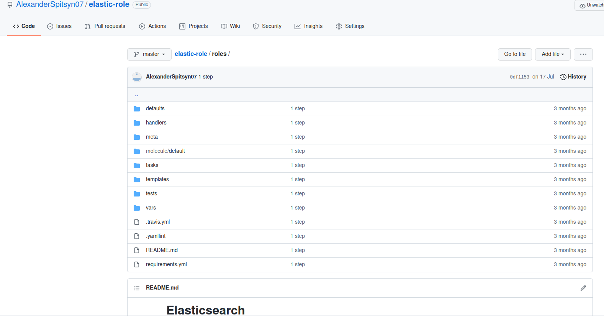
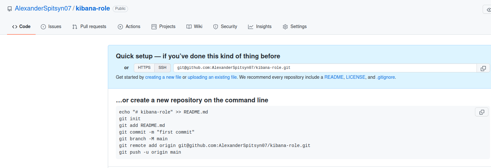

2. Скачайте [role](./roles/) из репозитория с домашним заданием и перенесите его в свой репозиторий elastic-role.
3. Скачайте дистрибутив [java](https://www.oracle.com/java/technologies/javase-jdk11-downloads.html) и положите его в директорию `playbook/files/`. 

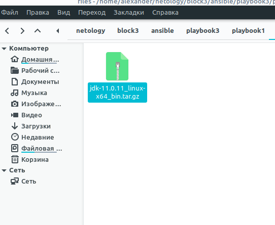

4. Установите molecule: `pip3 install molecule`

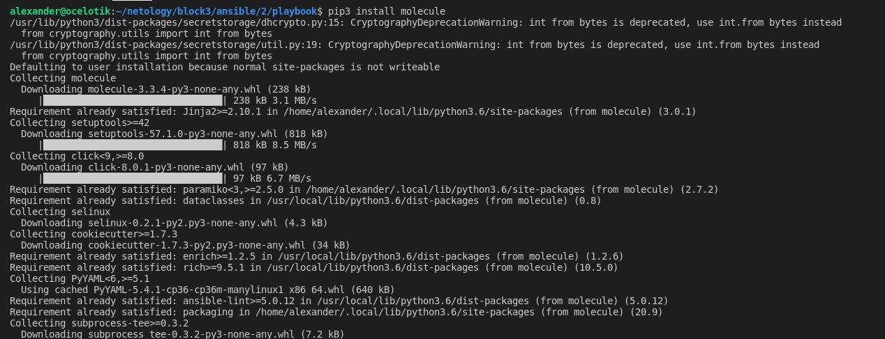

5. Добавьте публичную часть своего ключа к своему профилю в github.

## Основная часть

Наша основная цель - разбить наш playbook на отдельные roles. Задача: сделать roles для elastic, kibana и написать playbook для использования этих ролей. Ожидаемый результат: существуют два ваших репозитория с roles и один репозиторий с playbook.

1. Создать в старой версии playbook файл `requirements.yml` и заполнить его следующим содержимым:
   ```yaml
   ---
     - src: git@github.com:netology-code/mnt-homeworks-ansible.git
       scm: git
       version: "1.0.1"
       name: java 
   ```

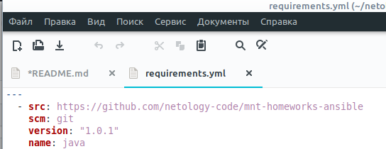

2. При помощи `ansible-galaxy` скачать себе эту роль. Запустите  `molecule test`, посмотрите на вывод команды.

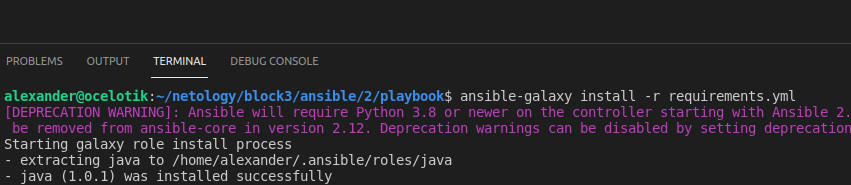
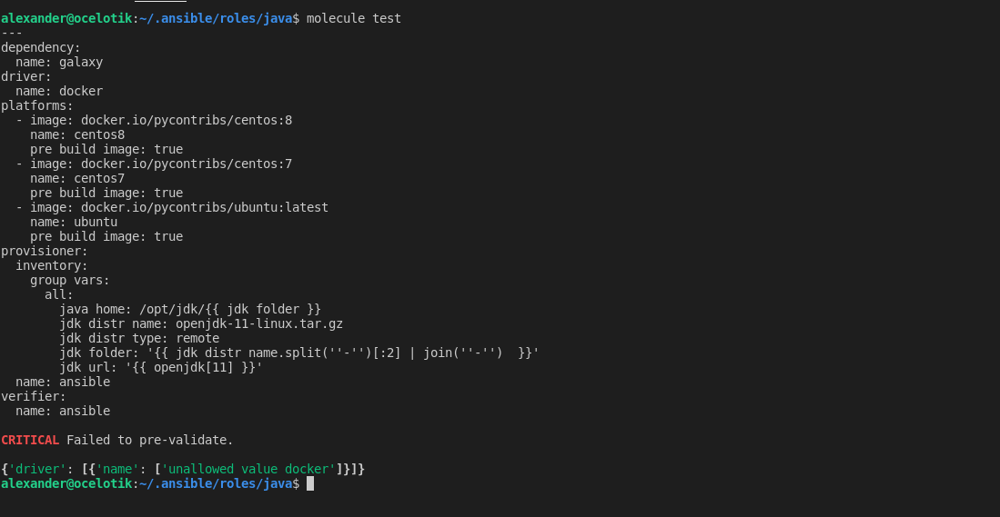


3. Перейдите в каталог с ролью elastic-role и создайте сценарий тестирования по умолчаню при помощи `molecule init scenario --driver-name docker`.

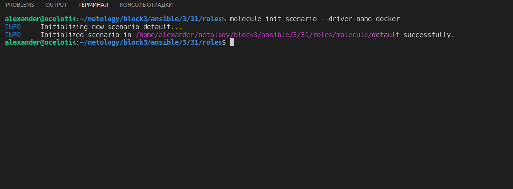

4. Добавьте несколько разных дистрибутивов (centos:8, ubuntu:latest) для инстансов и протестируйте роль, исправьте найденные ошибки, если они есть.

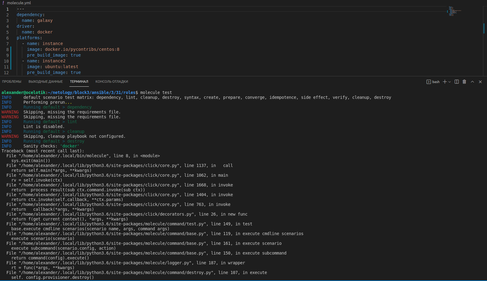

5. Создайте новый каталог с ролью при помощи `molecule init role --driver-name docker kibana-role`. Можете использовать другой драйвер, который более удобен вам.

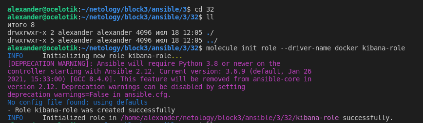

6. На основе tasks из старого playbook заполните новую role. Разнесите переменные между `vars` и `default`. Проведите тестирование на разных дистрибитивах (centos:7, centos:8, ubuntu).

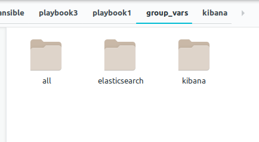

7. Выложите все roles в репозитории. Проставьте тэги, используя семантическую нумерацию.

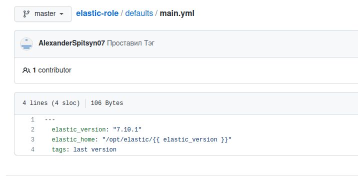
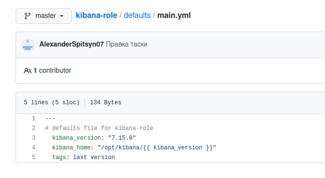

8. Добавьте roles в `requirements.yml` в playbook.

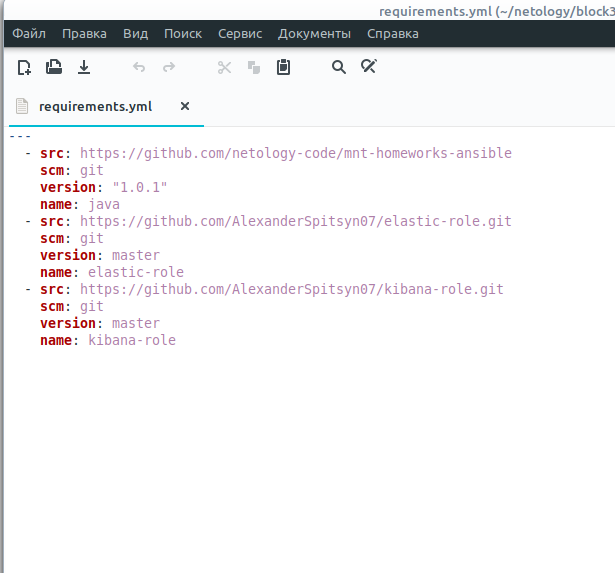

9. Переработайте playbook на использование roles.
10. Выложите playbook в репозиторий.
11. В ответ приведите ссылки на оба репозитория с roles и одну ссылку на репозиторий с playbook.

https://github.com/AlexanderSpitsyn07/elastic-role
https://github.com/AlexanderSpitsyn07/kibana-role
https://github.com/AlexanderSpitsyn07/playbookforroles

