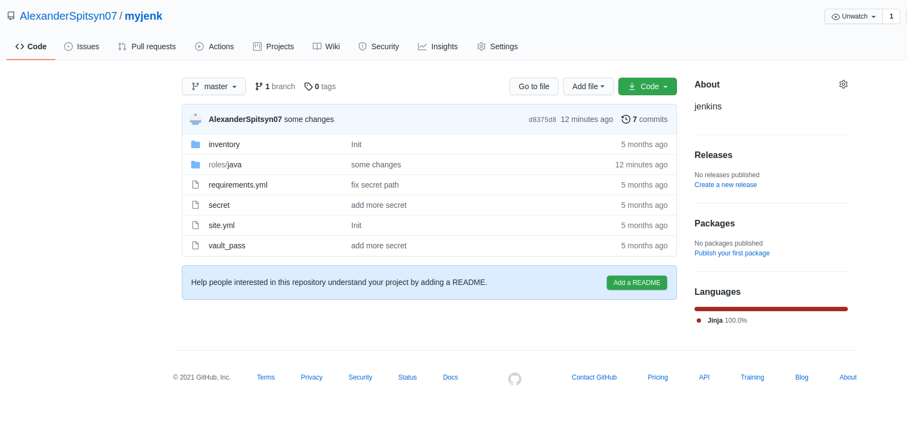

# Домашнее задание к занятию "09.03 Jenkins"

## Подготовка к выполнению

1. Установить jenkins по любой из [инструкций](https://www.jenkins.io/download/)

2. Запустить и проверить работоспособность
3. Сделать первоначальную настройку
4. Настроить под свои нужды

5. Поднять отдельный cloud

6. Для динамических агентов можно использовать [образ](https://hub.docker.com/repository/docker/aragast/agent)
7. Обязательный параметр: поставить label для динамических агентов: `ansible_docker`

8.  Сделать форк репозитория с [playbook](https://github.com/aragastmatb/example-playbook)

## Основная часть

1. Сделать Freestyle Job, который будет запускать `ansible-playbook` из форка репозитория

2. Сделать Declarative Pipeline, который будет выкачивать репозиторий с плейбукой и запускать её

3. Перенести Declarative Pipeline в репозиторий в файл `Jenkinsfile`

4. Перенастроить Job на использование `Jenkinsfile` из репозитория

5. Создать Scripted Pipeline, наполнить его скриптом из [pipeline](./pipeline)

6. Заменить credentialsId на свой собственный

7. Проверить работоспособность, исправить ошибки, исправленный Pipeline вложить в репозитрий в файл `ScriptedJenkinsfile`

8. Отправить ссылку на репозиторий в ответе
https://github.com/AlexanderSpitsyn07/myjenk
