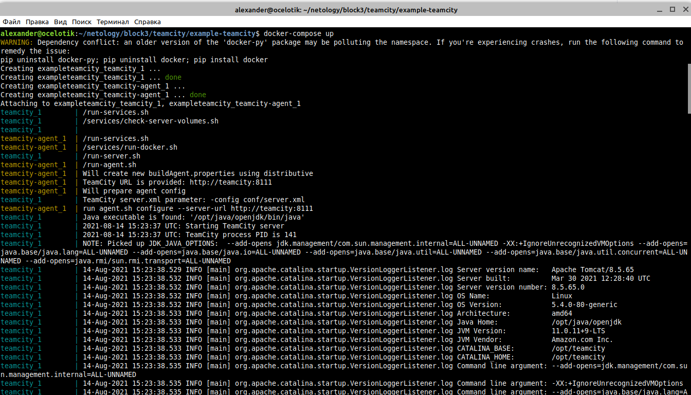

# Домашнее задание к занятию "09.04 Teamcity"

## Подготовка к выполнению

1. Поднимите инфраструктуру [teamcity](./teamcity/docker-compose.yml)

2. Если хочется, можете создать свою собственную инфраструктуру на основе той технологии, которая нравится. Инструкция по установке из [документации](https://www.jetbrains.com/help/teamcity/installing-and-configuring-the-teamcity-server.html)
3. Дождитесь запуска teamcity, выполните первоначальную настройку

4. Авторизуйте агент

5. Сделайте fork [репозитория](https://github.com/aragastmatb/example-teamcity)

## Основная часть

1. Создайте новый проект в teamcity на основе fork

2. Сделайте autodetect конфигурации

3. Сохраните необходимые шаги, запустите первую сборку master'a

4. Поменяйте условия сборки: если сборка по ветке `master`, то должен происходит `mvn clean package`, иначе `mvn clean test`

5. Мигрируйте `build configuration` в репозиторий

6. Создайте отдельную ветку `feature/add_reply` в репозитории

7. Напишите новый метод для класса Welcomer: метод должен возвращать произвольную реплику, содержащую слово `hunter`

8. Дополните тест для нового метода на поиск слова `hunter` в новой реплике

9. Сделайте push всех изменений в новую ветку в репозиторий

10. Убедитесь что сборка самостоятельно запустилась, тесты прошли успешно

11. Внесите изменения из произвольной ветки `feature/add_reply` в `master` через `Merge`

12. Убедитесь, что нет собранного артефакта в сборке по ветке `master`
13. Настройте конфигурацию так, чтобы она собирала `.jar` в артефакты сборки

14. Проведите повторную сборку мастера, убедитесь, что сбора прошла успешно и артефакты собраны

15. Проверьте, что конфигурация в репозитории содержит все настройки конфигурации из teamcity
16. В ответ предоставьте ссылку на репозиторий
https://github.com/AlexanderSpitsyn07/teamcity

